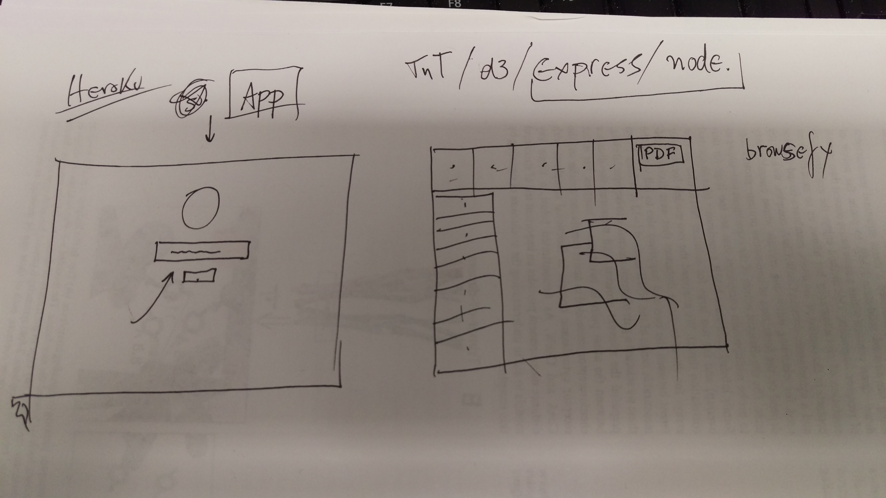

# phyloTreeVizJS
Our approach to visualization of phylogenetics trees using javascript and d3.js

We will build a webApp for tree visualization.

Humbly inspired by the work of others, we will use TnT, d3, express and node.

It should look like this:

